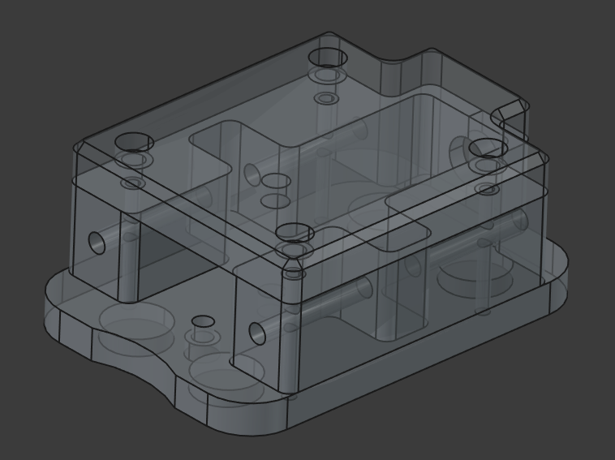
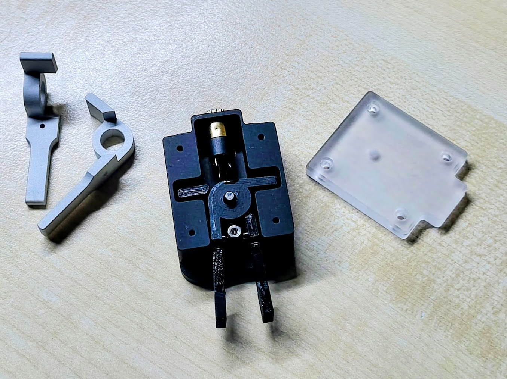
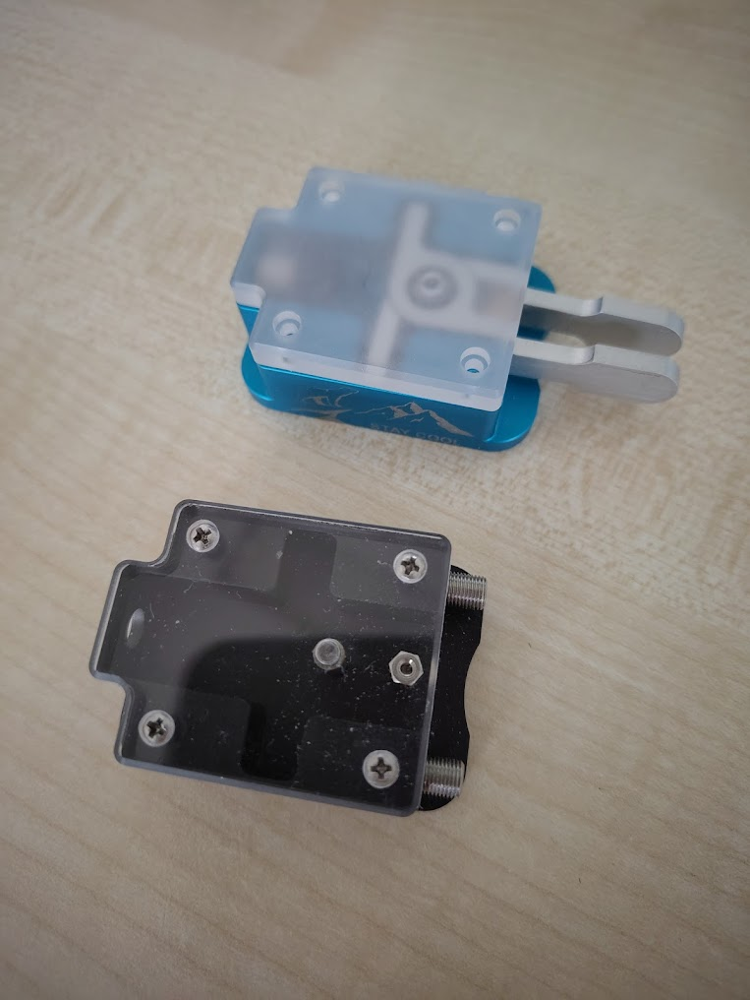
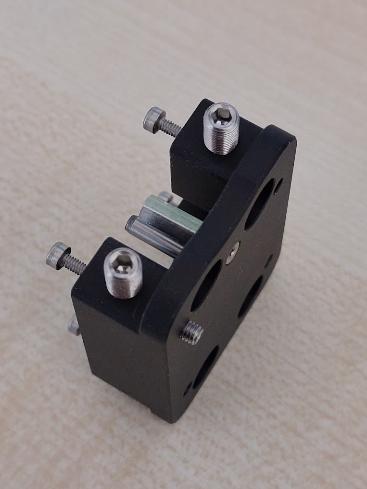
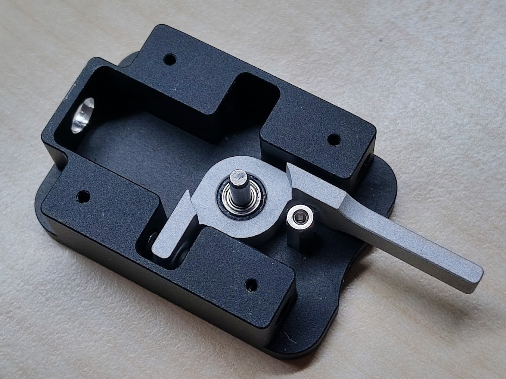
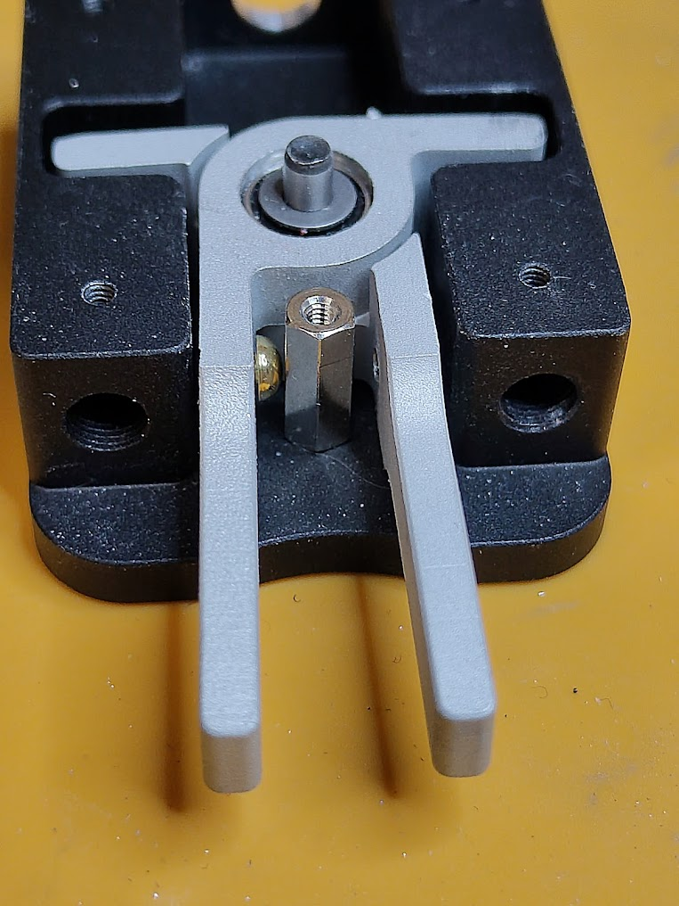
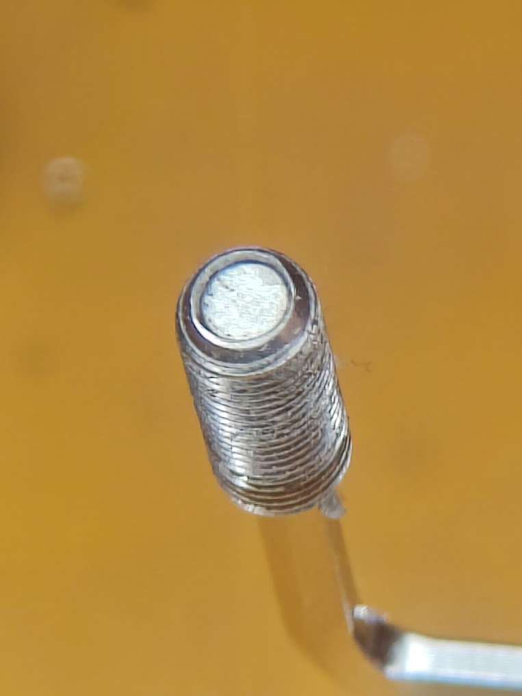

# bamakey-tp3
BaMaTech BaMaKey TP-iii clone. As Markus Baseler is <SK>, this is an attempt to reproduce the 3d files and BOM for his amazing TP-iii morse paddle.

# experimental BOM

- 1x ISO 8734 Dowel pin 3x16mm m6 
- 4x M2 screws for acrylic top cover
- 4x M3 grub screws to fixate the M5 retention/magnet grub screws
- 2x Button head screws unslotted for contact points on lever, got these but they're a tad to big: https://knupfer.info/shop/index.php/nieten-nietenschrauben/nietkopf-schrauben.html
- 4x M5x0,5x12 fine thread grub screws for magnets and retention, e.g. https://de.aliexpress.com/item/1005008239921011.html
- 3x2mm round magnets (used FPMYB)
- grub screw dog point plastic fine thread m5x0,5 would be good but didn't find any

- Isolating ball bearings: SS-HC-693-2RS-CN-ZV2-P6-GS Hybrid (Keramik, Edelstahl) Präzisions Miniatur Kugellager SS HC 693 2RS CN ZV2 P6 GS 3x8x4 mm

# cnc parts
First test run (paddles not yet in final shape):

Fitting test vice versa with original parts:

Fitting of all threads:

# caveats
## bearings
The original key has a plastic sleeve around the bearing for galvanic isolation. A printed one (PETG) is too sloppy, the paddles have too much flex. So the best idea so far is to use isolating bearings. CNC shop didn't guarantee tolerances for the bearing seat, so that's another topic.

## contact block
Very tight spacing:

## magnet tip grub screw
Didn't find any M5 fine threaded grub screws with magnetic tip. Self-made prototype:

Variant with glued on magnet:

